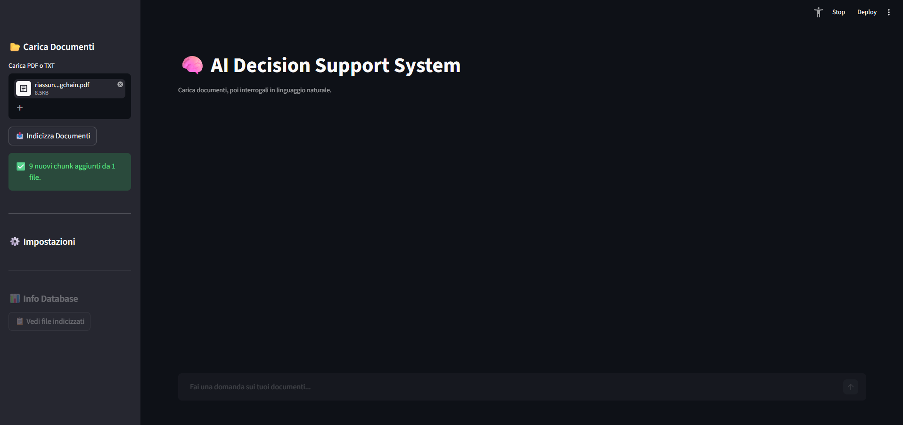
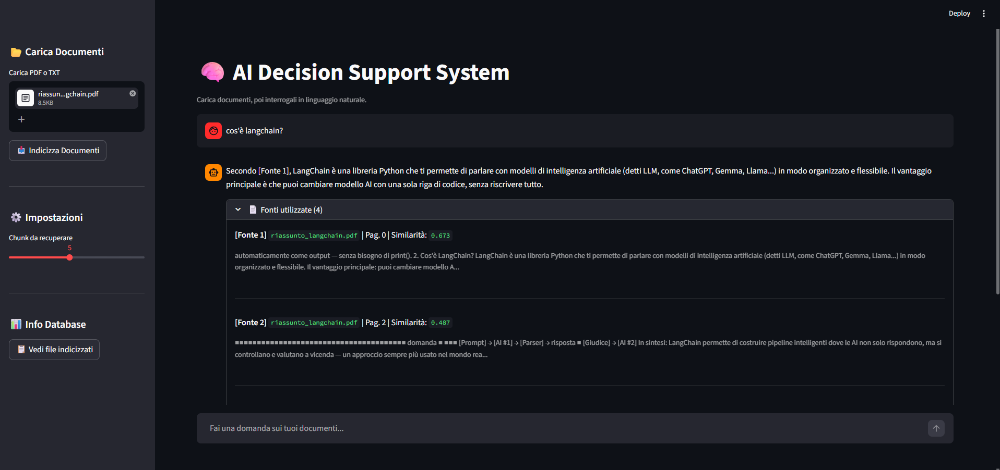

# 🧠 AI Decision Support System

A local RAG (Retrieval-Augmented Generation) pipeline built with Streamlit. Upload PDF or TXT documents, index them into a local vector store, and query them in natural language.

## Architecture

```
User Query
    │
    ▼
Embedding (sentence-transformers)
    │
    ▼
ChromaDB Vector Store ◄── Document Ingestion (PDF/TXT)
    │                           │
    ▼                     Chunking (LangChain)
Retrieved Chunks                │
    │               Embedding (sentence-transformers)
    ▼
Groq LLM (LLaMA 3.3 70B)
    │
    ▼
Answer + Source Citations
```

## Screenshots

**Document Upload**


**Chat with source citations**


**Stack:**
- **Frontend:** Streamlit
- **Embeddings:** `paraphrase-multilingual-mpnet-base-v2` (sentence-transformers) — runs locally, no API cost
- **Vector Store:** ChromaDB (persistent, local)
- **LLM:** LLaMA 3.3 70B via Groq API
- **Document Loading:** LangChain (PyPDF, TextLoader)

## Requirements

- Python 3.10+
- A [Groq API key](https://console.groq.com/) (free tier available)

## Setup

### 1. Clone the repository

```bash
git clone https://github.com/FrancescoSangalli/rag-project.git
cd rag-project
```

### 2. Create and activate a virtual environment

```bash
python -m venv venv

# Linux / macOS
source venv/bin/activate

# Windows
venv\Scripts\activate
```

### 3. Install dependencies

```bash
pip install groq chromadb langchain langchain-text-splitters langchain-community \
            sentence-transformers pypdf tiktoken streamlit python-dotenv
```

### 4. Configure environment variables

Create a `.env` file in the project root:

```
GROQ_API_KEY=your_groq_api_key_here
```

> The `.env` file is git-ignored. Never commit it.

### 5. Run the application

```bash
streamlit run app.py
```

The app will open at `http://localhost:8501`.

## Usage

1. **Upload documents** — Use the sidebar to upload one or more PDF or TXT files.
2. **Index** — Click "Indicizza Documenti". The app embeds and stores all chunks in ChromaDB. Already-indexed files are skipped automatically.
3. **Query** — Type a question in the chat input. The system retrieves the most relevant chunks and generates a cited answer.
4. **Inspect sources** — Expand the "Fonti utilizzate" section under each answer to see which chunks were used, with similarity scores.

### Settings

| Parameter | Default | Description |
|---|---|---|
| Chunk size | 800 chars | Size of each document chunk |
| Chunk overlap | 150 chars | Overlap between consecutive chunks |
| Top-k retrieval | 5 | Number of chunks retrieved per query |
| Similarity threshold | 0.4 | Minimum cosine similarity to include a chunk |

## Project Structure

```
rag_project/
├── app.py              # Streamlit UI and application logic
├── ingestion.py        # Document loading (PDF, TXT)
├── chunking.py         # Text splitting
├── embeddings.py       # Sentence-transformers embedding
├── vector_store.py     # ChromaDB operations
├── retrieval.py        # Similarity search
├── generation.py       # Groq LLM call and prompt
├── .env                # API keys (git-ignored)
├── .gitignore
└── README.md
```

> `chroma_db/` is created automatically on first indexing and is git-ignored.

## Notes

- The embedding model (~420MB) is downloaded automatically on first run from HuggingFace.
- All embeddings run locally — only the final generation step calls the Groq API.
- To reset the vector store, delete the `chroma_db/` folder and re-index.
